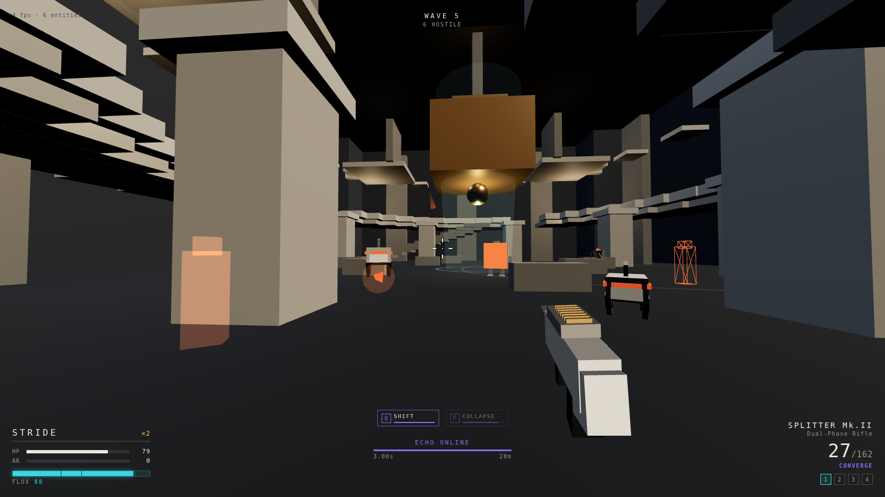
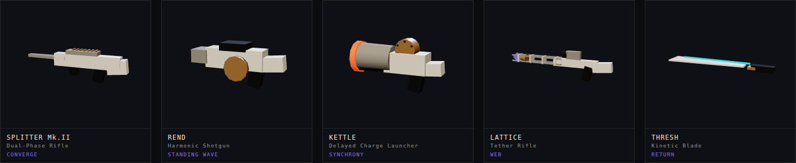
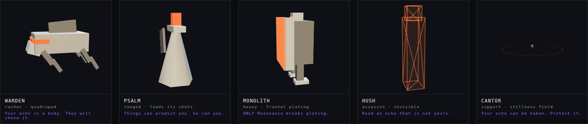
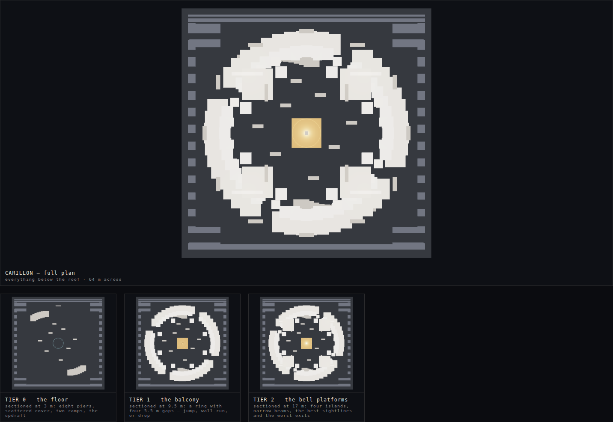
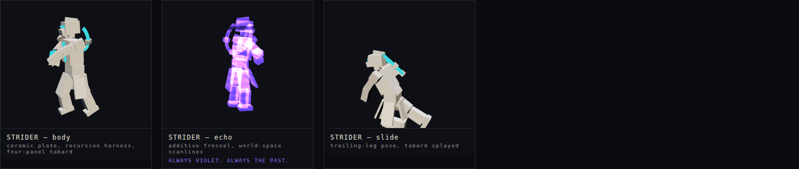

<div align="center">

# ECHOSTRIDE

### Fight beside the ghost of who you were.

**A first-person shooter built around one idea:**
*a copy of you from three seconds ago fights at your side — and you can trade places with it.*

<sub><a href="README.de.md">Auf Deutsch lesen →</a></sub>

</div>



---

## The mechanic

A translucent violet Strider follows you, **three seconds behind**. It walks
where you walked. It shoots what you shot. It deals **real damage** at 60% of
yours, it costs no ammunition, and **it can die**.

Then it gets interesting:

| | |
|---|---|
| **`Q` — SHIFT** | Trade places with your echo. You snap back to where you stood three seconds ago, keeping the velocity you had then — while your echo carries on down the route you just abandoned. One button turns one body into a pincer. |
| **RESONANCE** | Hit the same enemy as your echo within **half a second** and you land a **Resonant Strike**: ×2 damage, and the only thing in this game that shatters heavy plating. To do it on purpose you must have decided, three seconds ago, what you would be shooting now. |
| **`F` — COLLAPSE** | Spend your echo. It implodes, pulling enemies in, dealing damage scaled by how much damage *it* dealt while alive. Then you are alone for five seconds, and you feel it. |
| **PHASE-CATCH** | A hit that would kill you, with your echo alive and 50 Flux banked? Your past self catches you. A revive you paid for several seconds ago. |
| **THE DIAL** | Tune the delay from **1.5 s to 5.0 s**. Short: near-double DPS in your face. Long: a second front, a room away. It is the deepest build choice in the game and it is one number. |

> Full reasoning, tuning tables, and an honest list of what got cut:
> **[docs/ECHO_SHIFT.md](docs/ECHO_SHIFT.md)**

---

## Run it

```bash
npm install
npm run dev          # → http://127.0.0.1:5173
```

```bash
npm run build        # production build, 620 kB on disk, ~161 kB gzipped, zero asset files
npm run test:smoke   # headless: boots the real build and verifies the mechanic
```

The design gallery — every character, weapon and floor plan, rendered live from
the same code the game uses — is at **`/gallery.html`**.

---

## Controls

| | | | |
|---|---|---|---|
| Run | `W` `A` `S` `D` | **Shift to echo** | **`Q`** |
| Jump / wall-jump | `Space` | **Collapse echo** | **`F`** |
| Slide *(while fast)* | `Ctrl` | Echo delay ± | `+` `-` |
| Sprint | `Left Shift` | Fire / blade / reload | `LMB` `V` `R` |

Gamepad fully supported — **SHIFT is on `RB`**, the best button on the pad,
because it is a movement verb you press while holding the trigger.
Everything is remappable. Rationale for every binding:
**[docs/CONTROLS.md](docs/CONTROLS.md)**

---

## The arsenal

Every weapon is good alone, **and means something different in your echo's hands.**



| | Echo Synergy | What it asks of you |
|---|---|---|
| **SPLITTER Mk.II** · burst rifle | **CONVERGE** — rounds pierce a target your echo just hit | Can you hit the same target twice, three seconds apart? |
| **REND** · harmonic shotgun | **STANDING WAVE** — +80% when you and your echo fire from opposite sides | Can you get to the *other side* of a target in three seconds? |
| **KETTLE** · delayed charge launcher | **SYNCHRONY** — the fuse *is* your echo delay, always | Can you predict where a fight will be in three seconds? |
| **LATTICE** · tether rifle | **WEB** — your echo lays tethers too, so the web is always larger than you drew | Can you plan a shape instead of a shot? |
| **THRESH** · kinetic blade | **RETURN** — parried projectiles are pushed into your echo's timeline | Can you give your past self a weapon? |

→ **[docs/WEAPONS.md](docs/WEAPONS.md)**

---

## The Stillness



An order that believes recursion is a disease. Every enemy teaches one lesson
about the echo, and is unbeatable **in a boring way** if you ignore it.

| | |
|---|---|
| **WARDEN** | Your echo is a body. They will chase it. Use that. |
| **PSALM** | Things can lead a moving target. So can you. |
| **MONOLITH** | Frontal plating absorbs *everything*. Only Resonance breaks it. |
| **HUSH** | Invisible — but its own echo is not. Read it, and shoot three seconds ahead. |
| **CANTOR** | Its field freezes your echo's replay. Kill it first. |

→ **[docs/CHARACTERS.md](docs/CHARACTERS.md)**

---

## CARILLON



A bell tower with the bells still in it. 64 m across, three tiers, one open
shaft, and a nine-metre bell hung in the middle of the only long sightline.

Maps here obey three laws:

1. **No dead ends.** Your echo will walk your route again without thinking.
2. **The shaft.** One open volume most of the map can see into, so you can
   always find your violet twin.
3. **Three-second geometry.** Distances are tuned so a sprint covers them in
   one echo delay — 33.6 m at default settings. **The map is measured in echo
   delays**, not metres.

→ **[docs/MAPS.md](docs/MAPS.md)**

---

## What it develops from

The brief was to take shooters that already exist and push them further. Honest
accounting:

| | Taken | Changed |
|---|---|---|
| **Quake** | Directional air acceleration, strafe-jumping | Kept nearly verbatim; nothing since has improved on it |
| **Titanfall 2 / Apex** | Slide, wall-run, slide-hop chaining | Made *consequential* — your route becomes your ally's route |
| **DOOM Eternal** | Aggression as survival, resource starvation | Three resources collapsed into **one** bar: Flux, earned by damage *and* speed |
| **ULTRAKILL** | A style meter that rewards creativity | Replaced "be varied" with "be **coordinated**" |
| **Halo** | Sandbox variety, situational weapons | Situational identity comes from the echo, not a weakness chart |
| **SUPERHOT** | Time as something you think in | Same thinking, at full speed — a shooter, not a puzzle |

Each of those perfected a different loop and bolted the rest on. ECHOSTRIDE
collapses four loops into one question — **what will you have wanted to have
done, three seconds from now?** — and lets aggression, movement, style and
sandbox reading all be answers to it.

→ **[docs/GAME_DESIGN.md](docs/GAME_DESIGN.md)**

---

## Art direction — "Chromatic Brutalism"



Cast ceramic under hard light, and **exactly four emissive colours in the whole
game**:

<table>
<tr>
<td>🟦 <b>FLUX CYAN</b> <code>#39D7E0</code></td><td><b>You.</b></td>
</tr><tr>
<td>🟪 <b>ECHO VIOLET</b> <code>#8B6CF0</code></td><td><b>Your past.</b> Always. Nothing else is ever violet.</td>
</tr><tr>
<td>🟧 <b>OXIDE</b> <code>#E4572E</code></td><td><b>A threat.</b> Every hostile thing, without exception.</td>
</tr><tr>
<td>🟨 <b>GOLD</b> <code>#F5C242</code></td><td><b>Resonance.</b> The instant of a Resonant Strike. Nothing else. Ever.</td>
</tr>
</table>

A player who has learned four colours can read any frame of this game at a
glance — which, when you are tracking yourself, a copy of yourself, and a dozen
hostiles across three vertical tiers, is the difference between a mechanic and
noise.

**There are no assets.** No textures, no models, no audio files. Every surface
is flat colour plus light; every sound is synthesised at runtime. *Your* sounds
are struck metal — bells, because the whole game is set in a carillon. *Their*
sounds are blown noise. Your echo's sounds are yours again through a lowpass and
a reverb tail, so your past self is audibly further away in time.

→ **[docs/ART_DIRECTION.md](docs/ART_DIRECTION.md)**

---

## Under the hood

```
src/
├─ core/       Tuning.js ← every balance number in the game, in one file
│              Game.js · Input.js · Events.js
├─ player/     Movement.js  Quake-derived accel, slide, wall-run
│              Recorder.js  the ring buffer that makes the echo possible
│              Echo.js      your past self, and its path preview
│              Player.js    SHIFT · COLLAPSE · PHASE-CATCH
├─ weapons/    Arsenal.js   five weapons, five Echo Synergies
├─ combat/     Resonance.js the one place all damage flows through
│              Trace.js · Projectiles.js
├─ enemies/    Enemies.js   five types, five lessons
│              Director.js  waves as a curriculum, not a difficulty curve
├─ world/      Collision.js AABB brushes, swept, with step-up
│              MapBuilder.js  geometry and collision from one call
│              maps/carillon.js
├─ engine/     StriderMesh.js · WeaponMesh.js ← the character and weapon designs,
│              Materials.js · Fx.js · Audio.js    written as geometry
└─ ui/         Hud.js
```

Five decisions worth knowing about:

- **The recorder stores state, not input.** Replaying inputs needs eternal
  bit-exact determinism; one changed epsilon and your past self walks into a
  wall you went around. Replaying positions cannot desync.
- **Fixed 60 Hz simulation.** The recorder indexes by tick count, so the replay
  is frame-rate independent and SHIFT lands to the millimetre.
- **Geometry and collision come from one call.** Not a convenience — levels
  where art and collision are separate assets are levels where you eventually
  wall-run on a wall that is not there.
- **Every tunable is in `Tuning.js`.** Balancing is a single-file activity, and
  the docs quote the constant names directly.
- **The smoke test boots the real build in Chromium** and asserts the mechanic
  actually happened. It has already caught three bugs reading never would have:
  a pause overlay covering the main menu, an arena wall a sprinting player
  could walk straight through, and a weapon model parented to the world origin
  instead of the camera.

A full arena with a wave of enemies on screen costs **28 draw calls and about
3,000 triangles** — everything is merged per material, and there is nothing to
stream. The bottleneck on any real GPU is the browser, not this game.

---

## Status

**Playable prototype.** Endless waves on CARILLON, five enemy types, five
weapons, the full echo system.

Designed and not yet built: four more arenas, the THE CHOIRMASTER boss fight,
the four alternate Strider tunings, and the CHORUS loop cannon. All are
specified in `docs/`. The honest list of unsolved problems is
[GAME_DESIGN.md §8](docs/GAME_DESIGN.md#8-open-problems).

---

<div align="center">
<sub><i>Carillon: a set of bells played from a keyboard, where every note you strike<br>
keeps ringing while you play the next one.<br>
Strike a chord and you are accompanying yourself with sounds you made seconds ago.</i></sub>
</div>
